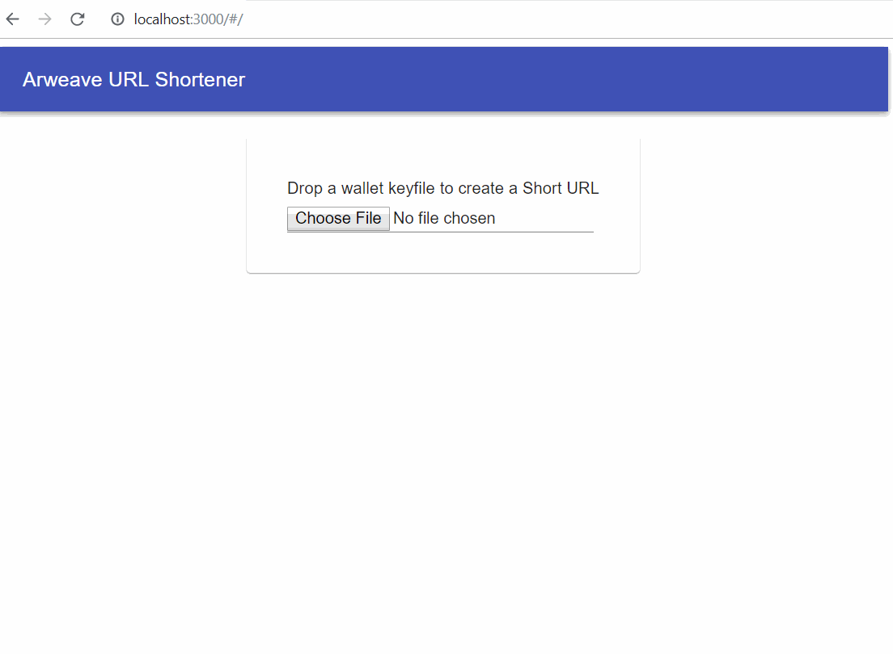

# Arweave-URL-Shortener

URL Shortening website that uses the [Arweave Blockchain](https://www.arweave.org/) as backend.

This application was made as a submission to this [Open Web Hackathon hosted on Gitcoin](https://gitcoin.co/issue/ArweaveTeam/Bounties/1/2929).

Deployed at: https://arweave.net/5S2y6AKvqZot6AxE-bs3oq0j1Dp3ywYadeeigzAdqE8

Here's a simple demo:

## Setting up locally

This app was made using create-react-app. To run it locally, run `npm install` and then `npm start`

To deploy, you need to create a production build using `npm run build` and follow [the instructions to deploy on arweave network](https://docs.arweave.org/developers/tools/arweave-deploy).
